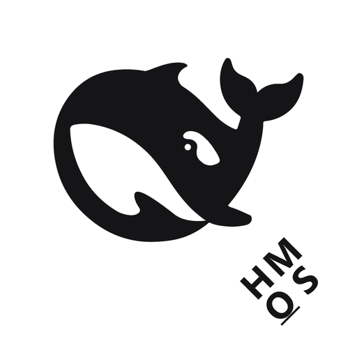

<div align="center">



# DSHM

**在 HarmonyOS 上自足运行 DeepSeek Harness 的应用**

</div>

DSHM 把 [DeepSeek Harness](https://github.com/deepseek-ai/deepseek-harness)（dsh）的**运行本体**装进一个鸿蒙应用：HAP 内自带 Node 运行时与 dsh 核心树，核心在本机 `127.0.0.1` 上起 Host，应用内的原生 ArkUI 页面就是这个本地 Host 的客户端。

**它不是 PC 上 dsh 的遥控器**，也不需要在电脑上常驻任何服务：装上即用，数据只在本机应用沙箱内。

支持 HarmonyOS 手机 / 折叠屏 / 平板 / 2in1。

> **这是一次平台移植**：把官方面向桌面（Electron）的运行时，搬到 OpenHarmony arm64 上自足运行。
> 移植过程中与鸿蒙平台语义的每一处冲突、根因与修法，都汇总在
> **[`docs/70-鸿蒙移植踩坑与修复总览.md`](docs/70-鸿蒙移植踩坑与修复总览.md)**（按技术主题组织）。
> **两条根本约束**决定了后面几乎所有设计：`jitless ⇒ WebAssembly === undefined`，
> 以及 **execve 受签名域管辖 ⇒ 所有端侧原生二进制必须构建期自签名**。

---

## 为什么需要它：官方没有鸿蒙端

上游 DeepSeek Harness 面向的是**桌面端（Windows / macOS，Electron）与 CLI**。它的运行前提有两条，在鸿蒙应用沙箱里**一条都不成立**：

1. 系统里有可执行的 Node 运行时；
2. 进程能直接 `execve` 任意二进制。

本仓库做的事，就是在官方未覆盖的平台上把这两条前提**逐条补出来**，并提供一个原生宿主：

| 官方形态依赖的前提 | 鸿蒙端侧现状 | 本仓库的补法 |
|---|---|---|
| 系统提供 Node 运行时 | 沙箱内无 Node，且只能执行**自己签名域内**的原生二进制 | 运行时与原生库随包分发（Node、koffi、node-pty、sherpa-onnx、libvips 等），构建期自签名；Host 跑在应用进程内，只监听 `127.0.0.1` |
| 上游直接 `import('undici')` 可用 | 端侧 `jitless ⇒ WebAssembly === undefined`，而 undici 的 HTTP 解析器是 WASM | 增加 `undici` 模块名解析钩子与全局 `fetch` 垫片，**不改上游源码、不改核心树**，由 `tools/check-web-fetch-jitless.mjs` 守着（自带对照实验） |
| 桌面工具链随手可用 | 沙箱里没有可执行文件 | git、Python 3.12、busybox、ripgrep 随包分发并自签名，启动时逐项 `exec` 探测 |
| Electron 提供窗口 / 托盘 / 文件选择器 | 平台是 ArkUI | 由 ArkUI 宿主提供窗口、菜单、托盘、系统文件选择器、剪贴板、通知与多形态布局 |
| 单机单形态 | 手机、折叠屏、平板、2in1 共用一份安装包 | 形态由断点判定，四种形态共享同一套信息架构 |

具体落成四件事：

- **运行时不依赖系统，随包分发。** HAP 内自带 Node 运行时与全部原生库，构建期完成自签名以进入应用签名域。代价是包体（约 300 MiB），换来"装上就能跑，不必先配环境"。
- **核心树可切换、可回滚。** dsh 核心树以归档形式随包分发，首次启动解包进应用数据目录下的版本仓库（`dsh/cores/<version>`），通过激活事务切换版本，失败可回滚 ⇒ **升级上游 = 换一个核心归档**，App 代码不动。
- **宿主重写，界面不重写。** 界面内容仍是官方 Web 前端；ArkUI 侧只承担平台宿主职责，设计令牌从官方 `--dsw-*` 映射到鸿蒙语义色与系统符号，不做 Web CSS 的像素级翻译——官方主题更新时不需要重做整套界面。
- **上架友好、数据保全优先。** 权限共 **11 项**（6 项普通 + 5 项 ACL 受限，逐项见 `entry/src/main/module.json5`），**不含** JIT / 可写可执行内存一类（无 `ohos.permission.kernel.*`、无 `ALLOW_WRITABLE_CODE_MEMORY`）；装机一律 `hdc install -r` 覆盖安装，应用数据原地保留（详见下文「真机数据保全」）。

端侧与官方的逐项对照（哪些对齐、哪些存在边界）登记在 [`docs/parity-matrix.md`](docs/parity-matrix.md)，由 `tools/check-parity.mjs` 强制维护；移植过程中踩到的坑按主题汇总在 [`docs/70-鸿蒙移植踩坑与修复总览.md`](docs/70-鸿蒙移植踩坑与修复总览.md)。

### 已知边界

- **WASM 缺席是全局前提。** 凡是上游直接 `import('undici')` 的功能都必须走垫片；新接入的上游功能若未覆盖，在端侧会直接失败。垫片覆盖由门禁守住，不靠自觉。
- **长连接抖动**：官方网关默认心跳间隔（2 s）对有重计算的会话偏紧，可能表现为连接短暂中断后自动恢复；这是 profile 层参数，可按机器调整。
- **冷启自退**：曾在旧核心版本上出现一次（启动约 40 s 后 `process.exit(0)`），当前版本长时间连续运行未复现，仍在定位中。

## 能力

| 领域 | 说明 |
|---|---|
| **本地核心** | 内置 Node 运行时（自建、`jitless`）与 dsh 核心树；Host 仅监听 `127.0.0.1`，随应用生命周期起停 |
| **对话与轨迹** | 对话视图（问答，思考过程折叠在回答上方）与轨迹视图（工具调用、子代理、目标/任务、交付物、错误）分开呈现 |
| **工作区** | 工作区为组、会话挂在组下；可在设备上选择文件夹作为工作区（系统文件夹选择器），并在其中浏览文件 |
| **模型与密钥** | 按提供方管理：API 密钥（只写）、`baseURL` 与模型目录；默认模型与推理强度可选 |
| **插件** | 查看随包插件清单与运行阶段；按行启用/禁用，并可恢复部署默认 |
| **核心版本** | 同时安装多个核心版本，一键**切换 / 回滚**（停旧起新，逐版本校验后激活） |
| **多语言** | 界面文案跟随系统语言，默认中文 |
| **上架友好** | 全部按 `jitless` 运行，**不申请** JIT / 可写可执行内存（无 `ohos.permission.kernel.*`、无 `ALLOW_WRITABLE_CODE_MEMORY`）；权限共 **11 项** = 6 项普通（网络、网络信息、后台保活、终止前回调、持久化数据、麦克风）+ **5 项 ACL 受限**（用户文件读写、文件访问持久化、全盘访问、自定义沙箱、外部原生代码加载）——ACL 这 5 项都服务于"用户可见目录读写 + 自定义沙箱"，随签名 profile 的 `acls` 声明，上架时按 ACL 清单在应用市场申请（逐项见 `entry/src/main/module.json5`） |

## 架构

```text
┌─ DSHM（一个 HAP）──────────────────────────────────────────────┐
│  ArkUI 原生页面（客户端）                                       │
│        │  HTTP /api/*        WebSocket /api/remote.mux          │
│        ▼                                                        │
│  端侧 dsh Host（Node 运行时运行在**本应用进程内**）              │
│        │  DSH_HOME = <应用沙箱>/dsh/home（跨版本共享的唯一数据）  │
│        ▼                                                        │
│  核心版本仓库（多个版本可并存，切换 = 停旧 + 起新 + 校验）        │
└─────────────────────────────────────────────────────────────────┘
```

同进程带来的是**安全语义的简化**：客户端与 Host 走回环，不需要把服务暴露到局域网，也不需要跨设备转发。

### 端侧运行时的硬约束：`jitless` ⇒ 没有 WASM

不申请 JIT 权限意味着 Host 全程以 `--jitless` 运行，而 V8 的 `--jitless` 与 `--expose_wasm` **互斥**
（启动即打印 `disabling flag --expose_wasm`），因此端侧 `typeof WebAssembly === 'undefined'`——这是恒定的，
不是配置问题。由此推出一条对上游代码的判据：

> **凡是上游直接 `import('undici')` 的功能，在端侧都会失败**，因为 undici 的 HTTP 解析器是 WASM
> （`lib/llhttp/llhttp-wasm.js`）。

已实测证实的一个实例：`dsh-web-fetch-http` 不用全局 `fetch`，而是 `await import('undici')` 自建 `Agent`
再传 `dispatcher`，于是 `web_fetch` 打不开任何网页和 IP，而走本仓纯 JS `node:http` 垫片的 `web_search` 照常工作。
同一核心树、同一个本地 HTTP 服务下，只有 `--jitless` 一个变量就能复现两组结果（有 WASM → 200；
无 WASM → `fetch failed / WebAssembly is not defined`）。细节与在飞修复见 `docs/parity-matrix.md` §3.2。

因此新增/升级核心版本时，除了跑既有门禁，还要**搜一遍核心树里对 `undici` 的直接依赖**，并把垫片覆盖率当作一项验收项。

对付它需要**两层**，缺一层就会出现"Host 起来了、模型也能回话，但某个工具静默坏掉"：

| 层 | 做什么 | 不做的后果 |
|---|---|---|
| 全局 fetch 垫片（`fetch-shim.js`） | 用 `node:http/https`（原生 llhttp）重写 `fetch/Request/Response/Headers/FormData` | 调模型就走不通（dsh 调模型就是用 fetch） |
| `undici` **模块名**解析钩子（`undici-shim.mjs` + `undici-loader.mjs`） | 让上游的 `await import("undici")` 拿到同一个垫片，并把 `dispatcher` 翻译成 `lookup` | **`web_fetch` 打不开任何网页**（`web_search` 却正常，因为后者走第一层） |

第二层由 `main.js` 的 `installUndiciNameHook()` 在 `WebAssembly` 不可用时注册；**不改上游源码、不改核心树**。
这条路径由 `tools/check-web-fetch-jitless.mjs` 守着——它自带对照实验：不注册钩子时必须失败（并给出
WASM 因果证据），注册后必须全过，且**跨源跳转仍须被拒**。

## 构建

前置：DevEco Command Line Tools（含 hvigor / ohpm / codelinter / SDK）、JDK 17、Node.js
（仅用于仓库内的构建与检查脚本）、**Python 3**（`tools/sign-tar-elf.py` 用它的 `tarfile`
改写工具链归档——Windows 上只有它能在保住归档内 symlink 的前提下改字节；缺失时
`place-toolchain` 会告警跳过签名，归档仍可用，只是端侧 `git`/`python3.12` 真身继续被执行策略拒绝）。

> **SDK 版本口径**：`compatibleSdkVersion` / `targetSdkVersion` 固定为 **`6.1.1(24)`**（决策，2026-09-14）。
> 代价是**不能用 API 26 的「沉浸光感」材质**（官方要求 `targetAPIVersion ≥ 26`）——
> 界面层次当前由系统阴影表达；升级路径与要改的几处列在 `appstate/ui/HarmonyTheme.ets` 的 `HarmonyMaterial`。

**不入库的产物（新克隆必须先备齐，否则编不过）**：

| 产物 | 路径 | 说明 |
|---|---|---|
| Node 头文件 | `entry/src/main/cpp/node-headers/` | 编 `libdshhost` 只需要它（`libnode` **不参与链接**） |
| 原生库 | `entry/libs/<abi>/` | 运行期需要（含 `libnode.so.137`）；也是"编不编 koffi/flock"的门 |
| git 兼容垫片 | `entry/libs/arm64-v8a/libdshm-gitcompat.so` | 由 CMake 从 `entry/src/main/cpp/gitcompat.c`（**源码在库里**）编出；git 子进程类命令的 `LD_PRELOAD` 垫片（见 `docs/device-validation.md` 批次备注十三 三） |
| 核心包 | `entry/src/main/resources/resfile/*.zip` | 首启解包出端侧核心树 |
| 工具链归档 | `entry/src/main/resources/resfile/toolchain/{python,git}/` | 由 `node tools/place-toolchain.mjs` 从 `third_party/` 放置并**自签名**（端侧 execve 只放行带 `.codesign` 的 ELF） |
| 入口脚本 | `entry/src/main/resources/resfile/resources/app/` | 由 `node tools/place-host-app.mjs` 从 `hostcore/app/` 生成 |
| 鲸鱼 SVG | `entry/src/main/resources/base/media/fish_logo.svg` | 由 `node tools/gen-fish-logo.mjs` 从核心树的官方 `dsh-client-ui-primitives` **逐字节**复制路径生成（`Image.fillColor` 按主题着色） |

```bash
# 1) 打完整体（HAP + 原生库 + 内置核心资源）
devecocli build

# 2) 需要重新打包核心树时（素材来自 dist/core/，产物落到应用资源目录）
node tools/pack-core.mjs --skip-install --place-in-app
node tools/place-host-app.mjs

# 2b) 需要重建工具链归档时（放置 + 自签名；会就地改写 resfile/toolchain/ 下的归档）
node tools/place-toolchain.mjs

# 2c) 重建顶栏鲸鱼 SVG 资源（从核心树的官方 primitives 包逐字节复制路径；内含
#     "真实包围盒 == 官方 viewBox" 与"落盘后仍与官方一致"两条自检，失败即退出）
node tools/gen-fish-logo.mjs

# 2d) 重建 **APP 图标**（官方鲸鱼 + HM/OS 角标）。需要 Python 3 + Pillow。
#     ⚠ 它**只写 APP 图标**：AppScope 与 entry 的 {foreground,background}.png、
#       docs/brand/dshm-icon.png、dshm-mark.png。**不写** startIcon.png / logo_dark.png
#       —— 那两个是**启动画面**资源，必须保持原版（正本归档在 third_party/brand-original/）。
#     全部自检通过才写盘；失败则一个文件都不动（含"归档比对"与"mark 不得带角标"两项）。
python tools/make-icon.py

# 3) 安装到已连接设备（注意：产物是 **unsigned**；签名材料不在库内）
hdc install -r entry/build/default/outputs/default/entry-default-signed.hap
```

## 设计体系：Web 语义 + HarmonyOS 原生表达

**产品语义对齐官方 Web，视觉与交互用 HarmonyOS 原生表达**——不是把 Web 的 CSS 机械翻译成 ArkUI：

| 层 | 落点 | 作用 |
|---|---|---|
| 尺度原语 | `appstate/ui/Tokens.ets` | `Sp` / `Radius` / `Border` / `Fs` / `Sz` / `Dur`（"有哪些档位"） |
| 语义令牌 | `appstate/ui/HarmonyTheme.ets` | 角色 → 系统语义资源（`sys.color.*`）+ 排版成套角色 + 层级/动效/触控；**`WEB_TOKEN_MAP`** 逐条映射官方 `--dsw-*` |
| 原生原语 | `entry/src/main/ets/view/NativePrimitives.ets` | `NativeChip` / `NativeCard` / `NativeButton` / `NativeActionBar` / `NativeSectionTitle` + Sheet 参数助手 |

**四条已经定下来的规则**（都是踩过或查证后写的，不是偏好）：

1. **浮层用系统形态**：半模态一律 `bindSheet`（`NativePrimitives.harmonySheetOptions` 统一参数），
   不再手写"整屏 Column + 自制遮罩"。原因：原生 Sheet 自带"非全屏、底层父视图可见"、拖拽关闭、
   遮罩与键盘避让——手写那套要逐个补回来，且必然补不全。
   > 注意 `bindSheet` 是**组件属性**，同一节点只能绑一个。本项目因此用**单一浮层宿主**：
   > 全应用只在根节点挂一次 `bindSheet`，由 `sheetKind()`（**从既有状态派生**，不另立字段）
   > 决定显示哪个浮层、`closeSheet()` 一处复位。这样结构上**不可能同时开出两个浮层**，
   > 复位逻辑也只写一次。
2. **遮罩交给系统**：不再手写 `rgba(...)` 遮罩（35% 黑在深色主题下观感就是错的），全部由原生 Sheet 提供。
3. **图标用系统符号**：`SymbolGlyph` 只支持系统预置资源，**不引入 Web SVG**（这条是 API 约束，不是偏好）。
4. **裸值只许变少**：`tools/check-design-tokens.mjs` 是棘轮门禁，管的是
   `fontSize`/圆角/描边/颜色字面量（含 `rgb()/rgba()/hsl()`——首版漏检过，已补）。

## 仓库结构

| 目录 | 作用 |
|---|---|
| `entry/` | 鸿蒙应用入口：ArkUI 页面与视图（含**原生原语** `view/NativePrimitives.ets`）、原生桥（`libdshhost`）、随包资源（核心包与原生库） |
| `hostcore/` | 端侧 Host 的入口脚本与 profile（`cordis.patch.yml`）、`fetch` 垫片，以及为绕开"端侧无 WASM"而做的 `undici` 模块名解析钩子 |
| `hostruntime/` | 核心版本仓库、激活事务、运行时载体（`RuntimePort` → `NodeRuntime`） |
| `appstate/` | 客户端状态中枢与投影（会话、轨迹、工作区、设置、凭据、插件、核心视图）。**纯逻辑层**（不 import ArkUI，可在本机直接测）：设计令牌与布局/导航决策（`ui/Tokens`、`ui/HarmonyTheme`、`ui/Breakpoints`、`ui/LayoutController`、`ui/NavigationController`）、回合与时间线、贴底跟随、输入模态（策略与事实）、工具呈现与改动对照。由 `tools/check-layout-fixtures.mjs` 逐条断言 |
| `platform/` | 系统能力封装（文件选择、剪贴板、通知、窗口记忆等） |
| `dshcompat/` | 与上游协议有关的**全部**事实：端点、参数形状、事件类型与投影键 |
| `tools/` | 构建与检查脚本（核心打包、依赖闭包、上架红线、协议往返、死按钮扫描等） |
| `docs/` | 文档基线，索引见 [`docs/README.md`](docs/README.md)；**接手先读 [`docs/HANDOFF.md`](docs/HANDOFF.md)**（现状 + 未完成事项 + Windows 端重装步骤） |

## 设计原则

1. **不 fork、不魔改 dsh**：端侧差异只通过 dsh 自己的组合面（profile / `cordis.patch.yml` / bundle）表达。
2. **不申请 JIT / 可写可执行内存**：需要它们作前提的方案一律不进入选型（这是 `--jitless` 的由来）。**ACL 受限权限只在文件访问与自定义沙箱必需处申请**——当前 5 项（用户文件读写、文件访问持久化、全盘访问、自定义沙箱、外部原生代码加载），随签名 profile 的 `acls` 声明，逐项见 `entry/src/main/module.json5`。
3. **界面不撒谎**：失败必须给出下一步；空态说明"可以做什么"；不可用的动作把原因写在旁边，而不是给一个点了没反应的入口。
4. **上游知识只出现在 `dshcompat`**：字段名、端点形状、事件类型集中一处，升级上游时改一个地方。
5. **产品语义跟 Web，视觉与交互用鸿蒙原生**：信息架构与行为对齐官方 Web（对等矩阵逐行登记），
   但视觉不用 Web CSS 的像素级翻译——用系统语义色、系统符号、原生控件（Sheet/菜单）、触控目标与多窗口语义表达。
   这样官方主题更新时不需要重做整套界面。

## 快速开始

### 只想装上用

到本仓库 **Releases** 下载最新的 `DSHM-1.1.0-core0.2.1-alpha.1+dshm.13-arm64-signed.hap`，然后：

```bash
hdc install -r DSHM-1.1.0-core0.2.1-alpha.1+dshm.13-arm64-signed.hap
```

首次启动会解包核心树（约 60–90 秒），期间停在启动页，属正常。
下载后请用同目录的 `SHA256SUMS.txt` 校验。

> Release 里附的是 **debug 签名的侧载包**，供尝鲜与验证；
> 正式分发请用 DevEco 生成你自己的发布签名。

### 想从源码构建

见上面的「构建」一节。注意**本仓库不含**原生库、核心包、工具链归档、入口脚本、Node 头文件与签名材料
（判据见「不入库的产物」表）—— 它们是构建产物或机器绑定材料，不入库。

## 真机数据保全（动手前务必读）

**绝对不要**执行 `hdc uninstall` / `bm uninstall`，或任何删除 `el2` 下用户数据的命令。
真机 `el2`（`files/dsh/home`）里的**会话 / 插件 / 工作区没有任何可用备份通道**
（`hdc` 读不到、`smode` 被拒、`run-as` 不存在），删掉不可恢复。

装机一律用**覆盖安装** —— 它只换 `el1`（代码与资源），不动 `el2`（用户数据）：

```bash
hdc install -r <hap>
```

判据：这条命令会不会碰 `el2`？会，就是禁止的。
完整事故复盘与流程见 [`docs/80-真机更新与数据保全.md`](docs/80-真机更新与数据保全.md)。

## 许可

见 [`LICENSE`](LICENSE)。

本项目是**移植**：把官方面向桌面的 dsh 运行时搬到鸿蒙。`dsh` / DeepSeek Harness 的商标与上游代码版权归其各自所有者，
本仓库只包含客户端侧的实现、适配与文档。
